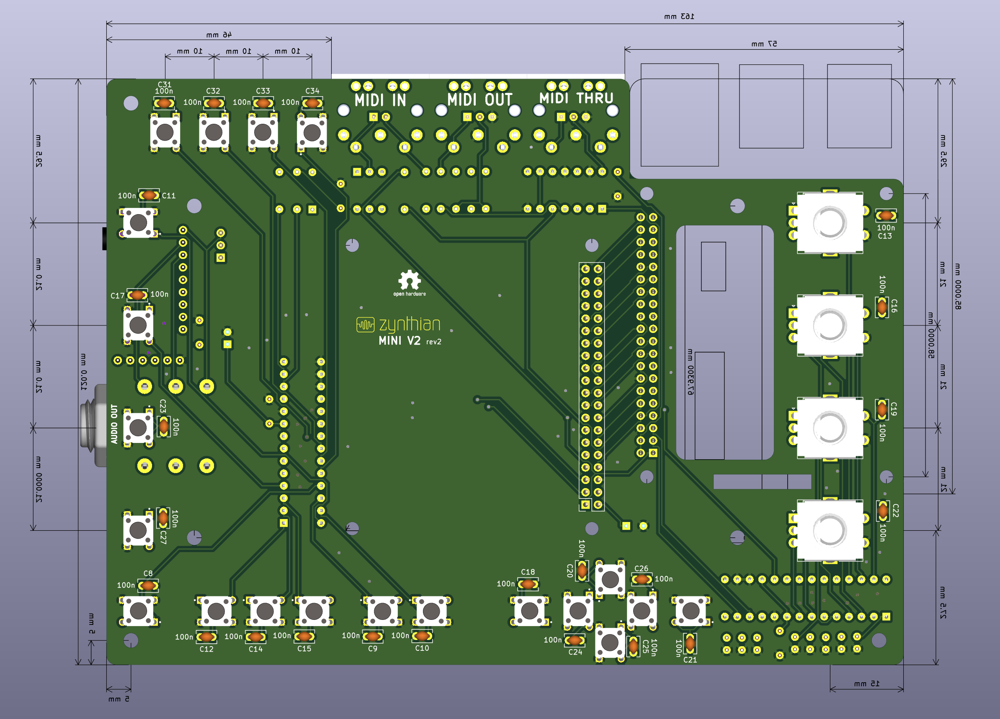
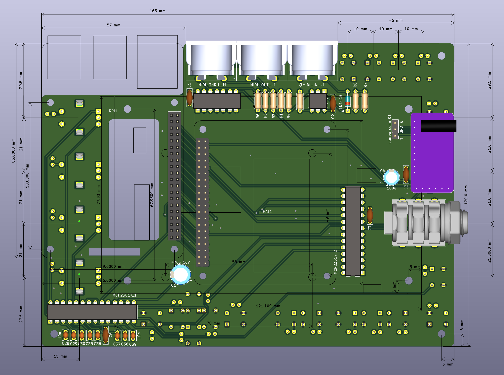
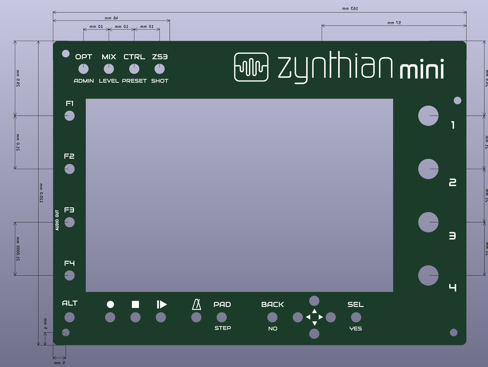

This repo include design details for building PCB for Zynthian MINI V2.

Zynthian PCB is designed usign KiCad software. 

Here is the front view of PCB:

Here is the back view of PCB:

This repository also include PCB that is used as a facia.

For more information about howe to build zynthian mini V2 go to [zynhtian wiki](https://wiki.zynthian.org/). 
